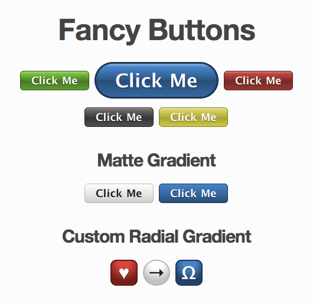

!SLIDE

# Compass, or be a sassly hacker of whatever you want

* Thibaut Assus, developer since 2007, notably with ruby + rails [http://github.com/tibastral](http://github.com/tibastral)
* French here with a business visa
* Working for my company in France named Milesrock, a ruby/rails/js consulting
  company.
* I will talk about Compass, Sass (and a little bit of Haml)

!SLIDE

## Why Sass ? And why Compass ? And why having semantic classes in your html

Remember doing things like :

@@@ html
&lt;div class="red right"&gt;
  My content
&lt;/div&gt;
@@@

That's just a little different than

@@@ html
&lt;div style="color:red text-align:right"&gt;
  My content
&lt;/div&gt;
@@@

!SLIDE

Doesn't it remains you the old days of things like that :

@@@ html
&lt;font color="#990000"&gt;
  This text is hexcolor #990000
&lt;/font&gt;
@@@

or even

@@@ html
&lt;p&gt;
  &lt;font size="7" face="Georgia, Arial" color="maroon"&gt;C&lt;/font&gt;
  ustomize your font to achieve a desired look.
&lt;/p&gt;
@@@

!SLIDE

## creating html elements with class="red" or class="right" is *NOT* doing things right, because, *STYLE* is part of your HTML.

!SLIDE

## Why is that so bad after all, we're just defining classes that we can reuse everywhere else ?

* We do agile development.

* Imagine the client want one day to change that red color to green ?

* You'll have to rename all your red classes to green, or you'll get into a mess soon.

* It'll be a lot less likely that a client could ask changing that good looking box for a completely other use.

## That's why we want to have "semantic" divs.

It helps also the next guy entering into your code to understand what you did with your markup.

!SLIDE
## The problem with that ?

If you want to use in different semantic parts of your website the same types of styling customization, you'll soon have a problem.

@@@ css
.user-infos{
  text-align: right;
  color: #ff5533;
}

.user-infos .email {
  color: #f67345
}

.user-infos .username {
  color: #f64578
  font-size: 120%
}
@@@

BECAUSE CSS IS SOOO VERBOSE ! And not so convenient

!SLIDE
## SASS TO THE RESCUE

in sass, you can define :

* constants
* methods

=> it's all converted to css

As in Python and HAML, the tabulation nest elements.

That's awesome. If you don't use it now, try it at least on your next project. Really, you won't regret it.

!SLIDE

# DEMO

!SLIDE

## Problem

All those methods you're defining could be put in a library or something like that.

## Guess what ?

That's the job of *COMPASS* to let you make libraries of all those chunks of sass methods and reuse and share them !

And *COMPASS* comes with a pretty amazing list of *built in methods* you can use in whatever sass stylesheet you want.

!SLIDE

## exemples :

You can for exemple have something like the fancy buttons project : https://github.com/imathis/fancy-buttons!

!SLIDE

## DEMO

!SLIDE

# Questions ?

!SLIDE

## Don't hesitate to email me for everything you didn't understand, I'm happy to help !

[tibastral@gmail.com](mailto:tibastral@gmail.com)

## If you want to use / fork these slides, help yourself :

[github.com/tibastral/compass-pres](http://github.com/tibastral/compass-pres)

!SLIDE

# Credits :

## Presentation done with :

[github.com/nakajima/slidedown](https://github.com/nakajima/slidedown)

Sassly hacked

## Compass :

[compass-style.org/docs/reference/compass](http://compass-style.org/docs/reference/compass/)

!SLIDE

# Thank You !
